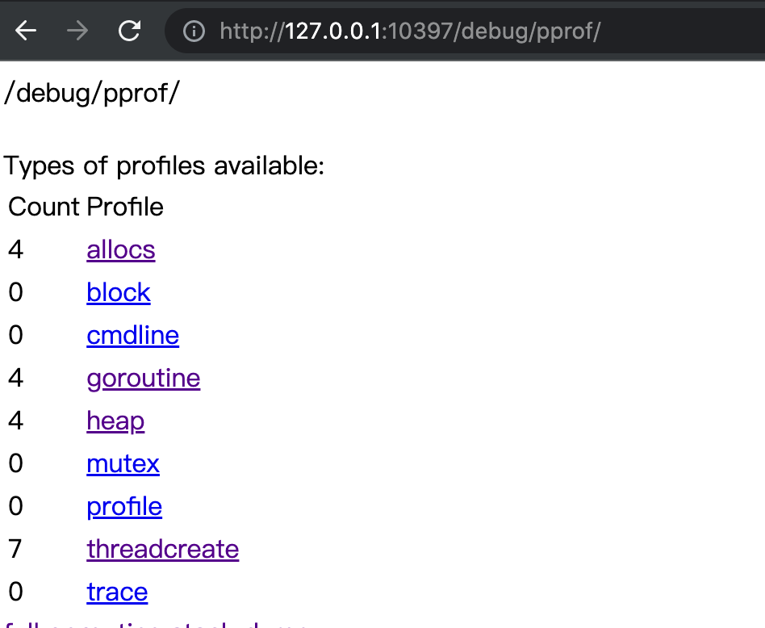
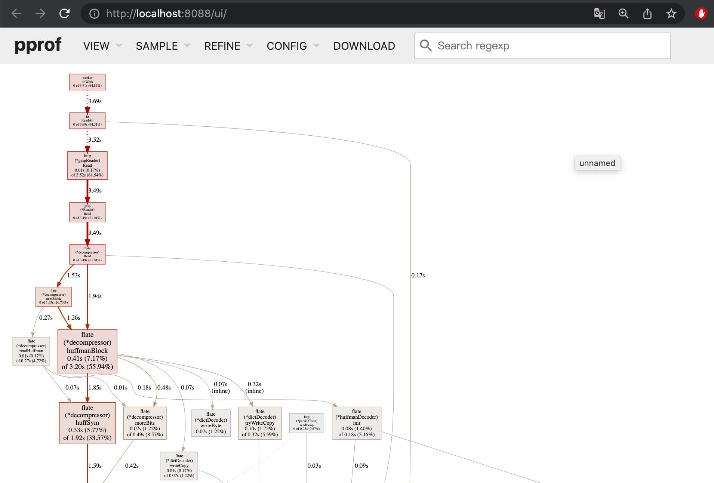
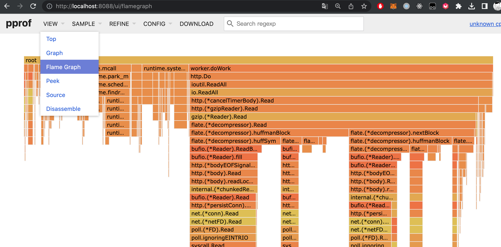
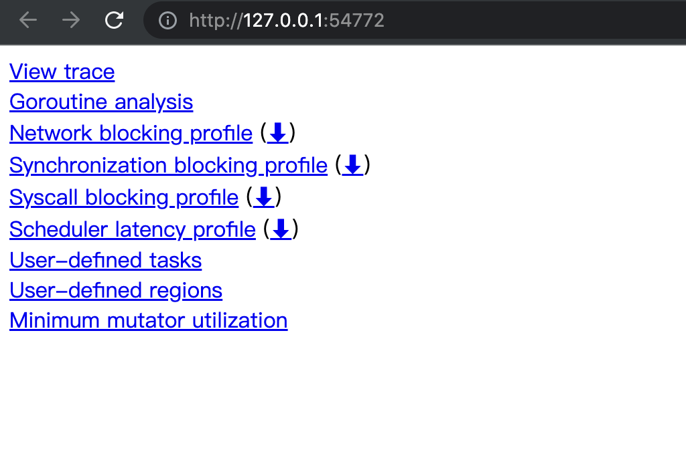
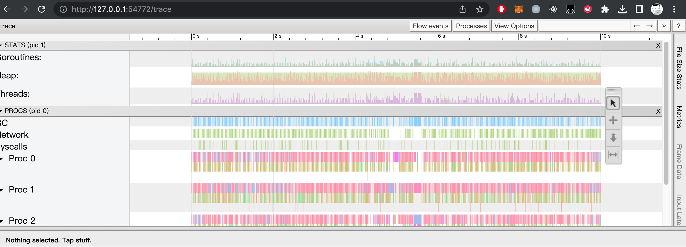

记录一次go代码性能调优实践。  
由于希望远程看到调试信息，直接使用http方式开启go的pprof调试
```Go
package main

import (
    "log"
    "net/http"
    _ "net/http/pprof" //关键代码，透明的讲pprof加入到代码
)

func main() {
    go func() {
        //do something
    }()

    http.ListenAndServe("0.0.0.0:10397", nil) //开启端口可以远程访问。
}
```
浏览器方法就能看到如下页面

这个页面非常好用，可以实时看到程序实时运行效果。  
如果需要看一段时间内的运行状态，需要用到go tool工具，go tool工具有两个方法，一个看pprof统计和trace。下面分开介绍。  
### pprof查看
```shell
curl "http://127.0.0.1:10397/debug/pprof/profile?seconds=10" -o p.out #获取最近10s的profile信息
go tool pprof -http=:8088 p.out #用浏览器查看刚刚profile文件
```
浏览器能直接看到刚刚profile信息


切换菜单就能看到最常用的火焰图。



### trace 查看
```shell
curl "http://127.0.0.1:10397/debug/pprof/trace?debug=1&seconds=10" > t.out #获取远程trace文件
go tool trace t.out #查看trace信息

```



